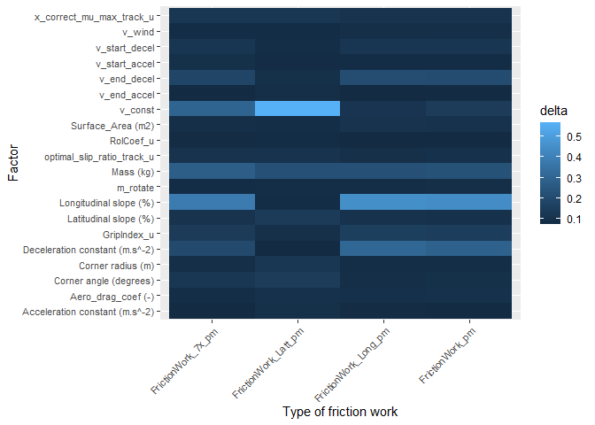

# Estimating the tyre abrasion coefficient

1.  First data on the maneuvers, track, vehicle, tyres and abrassion
    measurements need to be combined into a dataset for use further
    calculations. Then the following calculations are performed:
2.  Total Force at all the tyres together
3.  Total Slip at all tyres together
4.  Calculate total Friction Work for the relevant abrassion measurement
5.  Perform Global Sensitivity Analysis

## 1. Data prepartion

    ## # A tibble: 4,000 × 34
    ##    `Section name` `Test section` AbrasionTest  Track            `Number of laps`
    ##    <chr>          <chr>          <chr>         <chr>                       <dbl>
    ##  1 MotorwaySIML   Motorway_SIML  Motorway_SIML Oval Outer Lane…                1
    ##  2 MotorwaySIML   Motorway_SIML  Motorway_SIML Oval Outer Lane…                1
    ##  3 MotorwaySIML   Motorway_SIML  Motorway_SIML Oval Outer Lane…                1
    ##  4 MotorwaySIML   Motorway_SIML  Motorway_SIML Oval Outer Lane…                1
    ##  5 MotorwaySIML   Motorway_SIML  Motorway_SIML Oval Outer Lane…                1
    ##  6 MotorwaySIML   Motorway_SIML  Motorway_SIML Oval Outer Lane…                1
    ##  7 MotorwaySIML   Motorway_SIML  Motorway_SIML Oval Outer Lane…                1
    ##  8 MotorwaySIML   Motorway_SIML  Motorway_SIML Oval Outer Lane…                1
    ##  9 MotorwaySIML   Motorway_SIML  Motorway_SIML Oval Outer Lane…                1
    ## 10 MotorwaySIML   Motorway_SIML  Motorway_SIML Oval Outer Lane…                1
    ## # ℹ 3,990 more rows
    ## # ℹ 29 more variables: `Total distance (km)` <dbl>, RolCoef_u <dbl>,
    ## #   GripIndex_u <dbl>, Underground <chr>, x_correct_mu_max_track_u <dbl>,
    ## #   optimal_slip_ratio_track_u <dbl>, RUNS <int>, `Mass (kg)` <dbl>,
    ## #   `Aero_drag_coef (-)` <dbl>, `Surface_Area (m2)` <dbl>,
    ## #   `Longitudinal slope (%)` <dbl>, `Latitudinal slope (%)` <dbl>,
    ## #   v_wind <dbl>, m_rotate <dbl>, v_start_decel <dbl>, v_end_decel <dbl>, …

## 2. Total Force

Longitutidal and Lattidunal forces are calculated

    ## # A tibble: 6 × 36
    ## # Rowwise: 
    ##   `Section name` `Test section` AbrasionTest  Track             `Number of laps`
    ##   <chr>          <chr>          <chr>         <chr>                        <dbl>
    ## 1 MotorwaySIML   Motorway_SIML  Motorway_SIML Oval Outer LaneS…                1
    ## 2 MotorwaySIML   Motorway_SIML  Motorway_SIML Oval Outer LaneS…                1
    ## 3 MotorwaySIML   Motorway_SIML  Motorway_SIML Oval Outer LaneS…                1
    ## 4 MotorwaySIML   Motorway_SIML  Motorway_SIML Oval Outer LaneS…                1
    ## 5 MotorwaySIML   Motorway_SIML  Motorway_SIML Oval Outer LaneS…                1
    ## 6 MotorwaySIML   Motorway_SIML  Motorway_SIML Oval Outer LaneS…                1
    ## # ℹ 31 more variables: `Total distance (km)` <dbl>, RolCoef_u <dbl>,
    ## #   GripIndex_u <dbl>, Underground <chr>, x_correct_mu_max_track_u <dbl>,
    ## #   optimal_slip_ratio_track_u <dbl>, RUNS <int>, `Mass (kg)` <dbl>,
    ## #   `Aero_drag_coef (-)` <dbl>, `Surface_Area (m2)` <dbl>,
    ## #   `Longitudinal slope (%)` <dbl>, `Latitudinal slope (%)` <dbl>,
    ## #   v_wind <dbl>, m_rotate <dbl>, v_start_decel <dbl>, v_end_decel <dbl>,
    ## #   v_start_accel <dbl>, v_end_accel <dbl>, v_const <dbl>, …

## 3. Total Slip

    ## # A tibble: 4,000 × 38
    ## # Rowwise: 
    ##    `Section name` `Test section` AbrasionTest  Track            `Number of laps`
    ##    <chr>          <chr>          <chr>         <chr>                       <dbl>
    ##  1 MotorwaySIML   Motorway_SIML  Motorway_SIML Oval Outer Lane…                1
    ##  2 MotorwaySIML   Motorway_SIML  Motorway_SIML Oval Outer Lane…                1
    ##  3 MotorwaySIML   Motorway_SIML  Motorway_SIML Oval Outer Lane…                1
    ##  4 MotorwaySIML   Motorway_SIML  Motorway_SIML Oval Outer Lane…                1
    ##  5 MotorwaySIML   Motorway_SIML  Motorway_SIML Oval Outer Lane…                1
    ##  6 MotorwaySIML   Motorway_SIML  Motorway_SIML Oval Outer Lane…                1
    ##  7 MotorwaySIML   Motorway_SIML  Motorway_SIML Oval Outer Lane…                1
    ##  8 MotorwaySIML   Motorway_SIML  Motorway_SIML Oval Outer Lane…                1
    ##  9 MotorwaySIML   Motorway_SIML  Motorway_SIML Oval Outer Lane…                1
    ## 10 MotorwaySIML   Motorway_SIML  Motorway_SIML Oval Outer Lane…                1
    ## # ℹ 3,990 more rows
    ## # ℹ 33 more variables: `Total distance (km)` <dbl>, RolCoef_u <dbl>,
    ## #   GripIndex_u <dbl>, Underground <chr>, x_correct_mu_max_track_u <dbl>,
    ## #   optimal_slip_ratio_track_u <dbl>, RUNS <int>, `Mass (kg)` <dbl>,
    ## #   `Aero_drag_coef (-)` <dbl>, `Surface_Area (m2)` <dbl>,
    ## #   `Longitudinal slope (%)` <dbl>, `Latitudinal slope (%)` <dbl>,
    ## #   v_wind <dbl>, m_rotate <dbl>, v_start_decel <dbl>, v_end_decel <dbl>, …

## 4. Total Friction Work

    ## # A tibble: 994 × 10
    ## # Groups:   RUNS [994]
    ##     RUNS `Test section` FrictionWork_Long FrictionWork_Latt Distance_Track
    ##    <int> <chr>                      <dbl>             <dbl>          <dbl>
    ##  1     1 Motorway_SIML            279636.            12802.          9425.
    ##  2     2 Motorway_SIML            315673.            15872.          9425.
    ##  3     3 Motorway_SIML           2549390.             9455.          9425.
    ##  4     4 Motorway_SIML           1784395.            40175.          9425.
    ##  5     5 Motorway_SIML           1454854.            18445.          9425.
    ##  6     6 Motorway_SIML            243048.             4404.          9425.
    ##  7     7 Motorway_SIML            573886.            19739.          9425.
    ##  8     8 Motorway_SIML             99484.             4987.          9425.
    ##  9    10 Motorway_SIML            244517.            19851.          9425.
    ## 10    11 Motorway_SIML            847123.             7069.          9425.
    ## # ℹ 984 more rows
    ## # ℹ 5 more variables: FrictionWork_Long_pm <dbl>, FrictionWork_Latt_pm <dbl>,
    ## #   FrictionWork_pm <dbl>, FrictionWork_Latt_7x_pm <dbl>,
    ## #   FrictionWork_7x_pm <dbl>

## 5. Global Sensitivity Analysis

