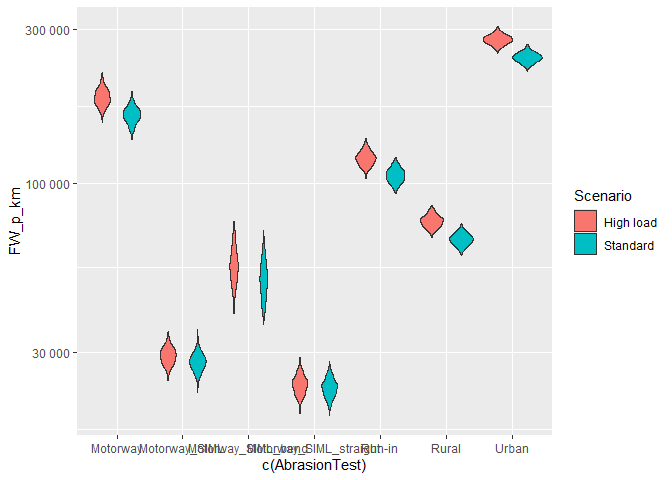

# Estimating the tyre abrasion coefficient \[Simulation\]

1.  First data on the maneuvers, track, vehicle, tyres and abrassion
    measurements need to be combined into a dataset for use further
    calculations. Then the following calculations are performed:
2.  Total Force at all the tyres together
3.  Total Slip at all tyres together
4.  Calculate total Friction Work for the relevant abrassion measurement
5.  Calculate the Abrasion Coefficient

## 1. Data prepartion

    library(tidyverse)

    ## ── Attaching core tidyverse packages ──────────────────────── tidyverse 2.0.0 ──
    ## ✔ dplyr     1.1.4     ✔ readr     2.1.5
    ## ✔ forcats   1.0.0     ✔ stringr   1.5.1
    ## ✔ ggplot2   3.5.1     ✔ tibble    3.2.1
    ## ✔ lubridate 1.9.3     ✔ tidyr     1.3.1
    ## ✔ purrr     1.0.2     
    ## ── Conflicts ────────────────────────────────────────── tidyverse_conflicts() ──
    ## ✖ dplyr::filter() masks stats::filter()
    ## ✖ dplyr::lag()    masks stats::lag()
    ## ℹ Use the conflicted package (<http://conflicted.r-lib.org/>) to force all conflicts to become errors

    source("R/Base functions.R")
    local_path <- "data/TWP emission data_IDIADA_v01_andSIML.xlsx"

    n.Runs = 1000 # for clearly uncertrain variables, amount of values to use

    source("R/SIML_dataprep.R")

    ## Joining with `by = join_by(Track, `Sector number`)`
    ## Joining with `by = join_by(Vehicle_class)`
    ## Joining with `by = join_by(Track, `Test section`)`

    source("R/SIML_force.R")
    source("R/SIML_slip.R")

    # AllData[1921,"Underground"]

    ### friction work ###
    AllData_fw <- 
      AllData |> mutate(
        DistanceManAccel =
          f_accel_distance(v_start = `Start speed (m/s)`,
                           v_end = `End speed (m/s)`,
                           c_accel = `Acceleration constant (m.s^-2)`),
        DistanceManDecel = 
          f_decel_distance(v_start = `Start speed (m/s)`,
                           v_end = `End speed (m/s)`,
                           c_decel = `Deceleration constant (m.s^-2)`),
        DistanceCorn = f_corner_distance(r_corner = `Corner radius (m)`,
                                         corner_angle = `Corner angle (degrees)`),
      )  |> mutate(DistanceConst = `Distance (m)`-
                     DistanceManAccel*`Maneuver repeats` - 
                     DistanceManDecel*`Maneuver repeats`,
                   FWAccelLong = list(ForceAccelLong*SlipAccelLong*DistanceManAccel*`Maneuver repeats`),
                   FWDecelLong = list(ForceDecelLong*SlipDecelLong*DistanceManDecel*`Maneuver repeats`),
                   FWConstLong = list(ForceConstLong*SlipConstLong*DistanceConst),
                   FWLat = list(
                     SlipCornLatt_M*ForceCornLatt_M*(DistanceManAccel+DistanceManDecel) +
                       SlipCornLatt_C*ForceCornLatt_C*DistanceConst),
                   FricWork_p_sector = list((FWAccelLong+FWDecelLong+FWConstLong+FWLat)) # calculate FW per sector
                   
      )

## 4. Total Friction Work

    FWtotals <-
      AllData_fw |> ungroup() |> 
      group_by(AbrasionTest,Tyre_brand,`Vehicle type`,Scenario,`Sector number`,`Maneuver number`,`Test section`) |> 
      unnest(FricWork_p_sector) #get the uncertainty runs to the tibble for summarise

    length(FWtotals$Track)

    ## [1] 2080000

    FWtotals <- FWtotals |>  mutate(RUN = rep(1:n.Runs)) # give code to each run

    FWtotals <-
      FWtotals |> ungroup() |> 
      group_by(AbrasionTest,Tyre_brand,`Vehicle type`,Scenario,`Test section`,RUN,`Total distance (km)`, `Number of laps`) |> 
      summarise(sector_count = n(),
                PartFrictionWork = sum(FricWork_p_sector)) |> # sum up all friction work per test section(for maneuvers?) (e.g. rural 60 kph)
      mutate(SectionFrictionWork = PartFrictionWork *`Number of laps`) # multiple test section with number of laps to get total FW per test per section

    ## `summarise()` has grouped output by 'AbrasionTest', 'Tyre_brand', 'Vehicle
    ## type', 'Scenario', 'Test section', 'RUN', 'Total distance (km)'. You can
    ## override using the `.groups` argument.

    # write.csv(FWtotals, "FWtotals2.csv")

    FWtotals <-
      FWtotals |>  ungroup() |> 
      group_by(AbrasionTest,Tyre_brand,`Vehicle type`,Scenario,RUN) |> 
      summarise(Section_count = n(),
                TotFrictionWork = sum(SectionFrictionWork), # sum the test sections to get total FW for the whole arbasion test
                Test_Distance_km = sum(`Total distance (km)`)) |> # sum up also the distance of each test section to get total distace driven in each test.
      mutate(FW_p_km = TotFrictionWork/Test_Distance_km) # devide total FW per test by the distance driven per test

    ## `summarise()` has grouped output by 'AbrasionTest', 'Tyre_brand', 'Vehicle
    ## type', 'Scenario'. You can override using the `.groups` argument.

    library(ggplot2)

    plotdata <- FWtotals |> filter(Tyre_brand == "Dunlop" & Scenario == "Standard") # plot FW for each test (J per km)

    plot <- ggplot(plotdata, aes(x = c(AbrasionTest), y = FW_p_km, fill=Tyre_brand )) +
      geom_violin()
    plot+  scale_y_log10(labels = scales::number_format())

    # boxplot(FWtotals)

    plotdata <- FWtotals |> filter( Scenario == "Standard") # plot FW for each test (J per km)

    plot <- ggplot(plotdata, aes(x = c(AbrasionTest), y = FW_p_km, fill=Tyre_brand )) +
      geom_violin()
    plot+  scale_y_log10(labels = scales::number_format())

    plotdata <- FWtotals |> filter( Scenario == "High load"|Scenario == "Standard",Tyre_brand == "LingLong") # plot FW for each test (J per km)

    plot <- ggplot(plotdata, aes(x = c(AbrasionTest), y = FW_p_km, fill=Scenario )) +
      geom_violin()
    plot+  scale_y_log10(labels = scales::number_format())

    ### end of FW

## 5. Abrasion Coefficient

    # read in and prepare abrasion rate measurement data
    IDIADAwear <- readxl::read_excel(path = local_path, sheet = "Abrasion", skip = 9)

    ## New names:
    ## • `` -> `...1`
    ## • `` -> `...2`

    #provide proper column names
    names(IDIADAwear)[c(1,2)] <- c("Tyre_brand","Wheel")

    # extend Tyre to all its rows
    for(i in 1:nrow(IDIADAwear)){
      if(is.na(IDIADAwear$Tyre_brand[i])){
        IDIADAwear$Tyre_brand[i] <- IDIADAwear$Tyre_brand[i-1]
      }
    }

    #What?
    IDIADAwear$C0 <- NULL

    # clean up rows with NA and calculated data
    IDIADAwear <- 
      IDIADAwear |> separate(col = Tyre_brand,
                             into =c("Tyre_brand", "Scenario"),
                             sep = "     ")|> 
      filter(!is.na(Wheel)) |> 
      filter(Wheel != "Total") |> 
      filter( Wheel != "Front") |> 
      filter(Wheel != "Rear") 

    ## Warning: Expected 2 pieces. Missing pieces filled with `NA` in 39 rows [1, 2, 3, 4, 5,
    ## 6, 7, 8, 25, 26, 27, 28, 29, 30, 31, 32, 33, 34, 35, 36, ...].

    #Track to long format
    WearAsLong <- tidyr::pivot_longer(IDIADAwear, 
                                      cols = names(IDIADAwear)[!names(IDIADAwear) %in% c("Tyre_brand","Wheel","Scenario")],
                                      names_to = c("Shift","AbrasionTest"),
                                      names_sep = "-",
                                      values_to = "Abrasion_mg_km")

    WearAsLong <-
      WearAsLong |> mutate(
        AbrasionTest = 
          AbrasionTest |> recode(
            "Runin" = "Run-in",
            "Rur" = "Rural",
            "Mot" = "Motorway",
            "Ur" = "Urban"
          ),
        Scenario = Scenario |> 
          replace_na("Standard")
      )

    WearAsLong <- # aggregate data per wheel to total per vehicle
      WearAsLong |> ungroup() |> 
      group_by(Tyre_brand ,Scenario ,Shift , AbrasionTest) |> 
      summarise(Abrasion_mg_km = sum(Abrasion_mg_km),
                nWheels = n())

    ## `summarise()` has grouped output by 'Tyre_brand', 'Scenario', 'Shift'. You can
    ## override using the `.groups` argument.

    CombinedFW_TW <- 
      left_join(WearAsLong,FWtotals, relationship = "many-to-many") |> 
      mutate(AbrasionCoeff = Abrasion_mg_km / FW_p_km) |> # Calculate the abrasion coefficient
      mutate(TestScenName = paste(Tyre_brand, Scenario, sep = "-"))

    ## Joining with `by = join_by(Tyre_brand, Scenario, AbrasionTest)`

    ABR_COEF_avg <-
      CombinedFW_TW |> filter(AbrasionTest != "Run-in" & Scenario == "Standard") |> ungroup() |> group_by(AbrasionTest) |>  summarise(mean(AbrasionCoeff))

    unique(CombinedFW_TW$AbrasionTest)

    ## [1] "Run-in"   "Motorway" "Rural"    "Urban"

    # figure of tyre fricction work

    kData25 <-  CombinedFW_TW |> filter(AbrasionTest != "Run-in" & Scenario == "Standard") 
    # str(kData25)

    plot_theme = theme(
      axis.title.x = element_text(size = 16),
      axis.text = element_text(size = 14), 
      axis.title.y = element_text(size = 16),
      plot.background = element_rect(fill = 'white'),
      panel.background = element_rect(fill = 'white'),
      panel.grid.major = element_blank(),
      panel.grid.minor = element_blank(),
      axis.line = element_line(color='black'),
      plot.margin = margin(1, 1, 1, 1, "cm")
      #panel.grid.major = element_line(colour = "grey",size=0.25)
    )

    kData25

    ## # A tibble: 75,000 × 14
    ## # Groups:   Tyre_brand, Scenario, Shift [25]
    ##    Tyre_brand Scenario Shift AbrasionTest Abrasion_mg_km nWheels `Vehicle type`
    ##    <chr>      <chr>    <chr> <chr>                 <dbl>   <int> <chr>         
    ##  1 Dunlop     Standard T1    Motorway               432.       4 Esccape Kuga  
    ##  2 Dunlop     Standard T1    Motorway               432.       4 Esccape Kuga  
    ##  3 Dunlop     Standard T1    Motorway               432.       4 Esccape Kuga  
    ##  4 Dunlop     Standard T1    Motorway               432.       4 Esccape Kuga  
    ##  5 Dunlop     Standard T1    Motorway               432.       4 Esccape Kuga  
    ##  6 Dunlop     Standard T1    Motorway               432.       4 Esccape Kuga  
    ##  7 Dunlop     Standard T1    Motorway               432.       4 Esccape Kuga  
    ##  8 Dunlop     Standard T1    Motorway               432.       4 Esccape Kuga  
    ##  9 Dunlop     Standard T1    Motorway               432.       4 Esccape Kuga  
    ## 10 Dunlop     Standard T1    Motorway               432.       4 Esccape Kuga  
    ## # ℹ 74,990 more rows
    ## # ℹ 7 more variables: RUN <int>, Section_count <int>, TotFrictionWork <dbl>,
    ## #   Test_Distance_km <dbl>, FW_p_km <dbl>, AbrasionCoeff <dbl>,
    ## #   TestScenName <chr>

    FW_plot <- ggplot(kData25, 
                      aes(x = reorder(AbrasionTest,FW_p_km), y = FW_p_km/1000, fill=reorder(AbrasionTest, FW_p_km))) +
      geom_violin()+
      theme(legend.position="none")+
      # scale_y_log10(labels = scales::number_format()) +             # Log-transform y-axis
      labs(x = "Abrasion test scenario", y = "Friction Work (J/m)") +                   # Adjust labels
      # coord_flip() +
      plot_theme +
      labs(fill = "Tyre")
    FW_plot

    ggsave(paste0("figures/FrictionWork_AbrasionT_Tyre_5x5",format(Sys.time(),'%Y%m%d'),".png"),
           width = 5, height = 5)

    # Figure of abrasion measurements per tyre type tested
    plotdata <- CombinedFW_TW |> 
      filter( Scenario == "Standard") |> ungroup() |> 
      group_by(Tyre_brand ,Scenario , Shift, AbrasionTest , `Vehicle type`,TestScenName) |>   summarise(Abrasion_mg_km=mean(Abrasion_mg_km),
                                                                                                        n=n(),
                                                                                                        sd=sd(Abrasion_mg_km))

    ## `summarise()` has grouped output by 'Tyre_brand', 'Scenario', 'Shift',
    ## 'AbrasionTest', 'Vehicle type'. You can override using the `.groups` argument.

    plotdata |> ungroup() |> 
      group_by(Scenario , AbrasionTest , `Vehicle type`) |> 
      summarise(            min = min(Abrasion_mg_km),
                            p5 = quantile(Abrasion_mg_km, probs=0.05),
                            AvgAbrasion_mg_km = mean(Abrasion_mg_km),
                            p50 = quantile(Abrasion_mg_km, probs=0.5),
                            p95 = quantile(Abrasion_mg_km, probs=0.95),
                            max = max(Abrasion_mg_km),
                            
                            n_abr = n())

    ## `summarise()` has grouped output by 'Scenario', 'AbrasionTest'. You can
    ## override using the `.groups` argument.

    ## # A tibble: 4 × 10
    ## # Groups:   Scenario, AbrasionTest [4]
    ##   Scenario AbrasionTest `Vehicle type`   min    p5 AvgAbrasion_mg_km   p50   p95
    ##   <chr>    <chr>        <chr>          <dbl> <dbl>             <dbl> <dbl> <dbl>
    ## 1 Standard Motorway     Esccape Kuga    343.  377.              545.  545.  820.
    ## 2 Standard Run-in       Esccape Kuga    122.  124.              198.  206.  267.
    ## 3 Standard Rural        Esccape Kuga    251.  269.              360.  345.  467.
    ## 4 Standard Urban        Esccape Kuga    711.  842.             1503. 1415. 2166.
    ## # ℹ 2 more variables: max <dbl>, n_abr <int>

    ggplot(kData25, 
           aes(x = reorder(AbrasionTest, Abrasion_mg_km), y = Abrasion_mg_km, fill = AbrasionTest ) ) +
      geom_violin() + theme(legend.position="none")+
      # geom_point(aes(colour = reorder(TestScenName, Abrasion_mg_km)), 
      # position = position_jitterdodge(jitter.width = 0.1,
      # dodge.width = 0.75))+
      labs(x = "Abrasion test scenario", y = "Abrasion rate (mg/km)") +                   # Adjust labels
      
      plot_theme 

    ggsave(paste0("figures/AbrasionRate_AbrasionT_Tyre_5x5",format(Sys.time(),'%Y%m%d'),".png"),
           width = 5, height = 5)

    kData25_2 <- kData25 |> 
      mutate(AbrasionTest = factor(AbrasionTest, levels = c("Rural", "Motorway", "Urban")))

    ACplot1 <- ggplot(kData25_2, 
                      aes(x = c(AbrasionTest), y = AbrasionCoeff*1000,fill = AbrasionTest )) +
      geom_violin() +theme(legend.position="none")+
      # geom_point(aes(colour = reorder(TestScenName, AbrasionCoeff)), 
      # position = position_jitterdodge(jitter.width = 0.05,
      # dodge.width = 0.75))+
      labs(x = "Abrasion test scenario", y = "Abrasion Coeff (mg/kJ)") +                   # Adjust labels
      
      plot_theme 
    ACplot1

    ggsave(paste0("figures/AbrasionCoef1_AbrasionT_Tyre_5x5",format(Sys.time(),'%Y%m%d'),".png"),
           width = 5, height = 5)

    # Normalized_motorway <- 
    FWtotals |>ungroup() |>  distinct(AbrasionTest)

    ## # A tibble: 7 × 1
    ##   AbrasionTest          
    ##   <chr>                 
    ## 1 Motorway              
    ## 2 Motorway_SIML         
    ## 3 Motorway_SIML_bend    
    ## 4 Motorway_SIML_straight
    ## 5 Run-in                
    ## 6 Rural                 
    ## 7 Urban

    Normalized_motorway <-
      FWtotals |>ungroup() |>  filter(AbrasionTest == "Motorway_SIML"&Scenario == "Standard") |> rename(Normalized_FW_p_km = FW_p_km) |> select(Tyre_brand, `Vehicle type`,Scenario,Normalized_FW_p_km) |> mutate(RUN = rep.int(rep(1:n.Runs),5))

    Normalized_motorway2 <-
      kData25 |> filter(AbrasionTest == "Motorway") |> 
      left_join(Normalized_motorway) |> 
      mutate(MotorWayEF_mgkm = Normalized_FW_p_km*AbrasionCoeff) |> 
      mutate(AbrasionTest = "Motorway sim")

    ## Joining with `by = join_by(Tyre_brand, Scenario, `Vehicle type`, RUN)`

    Normalized_motorway2 |> ungroup() |> distinct(`Vehicle type`)

    ## # A tibble: 1 × 1
    ##   `Vehicle type`
    ##   <chr>         
    ## 1 Esccape Kuga

    ACplot2 <- ggplot(Normalized_motorway2, 
                      aes(x = reorder(Tyre_brand,MotorWayEF_mgkm), y = MotorWayEF_mgkm ,fill = Tyre_brand)) +
      geom_violin() +theme(legend.position="none") +
      # geom_point(aes(colour = TestScenName), position = position_jitterdodge(jitter.width = 0.05,
      #                                                                      dodge.width = 0.75))+
      labs(x = "Abrasion test scenario", y = "Abrasion Rate (mg/km)") +                   # Adjust labels
      
      plot_theme 
    ACplot2

    ggsave(paste0("figures/EmissionFactor_sim_Tyre",format(Sys.time(),'%Y%m%d'),".png"),
           width = 5, height = 5)

### ADAC

Add Abrasion data from ADAC

    ADAC_wear <- readxl::read_excel(path = local_path, sheet = "Abrasion_ADAC")

    Normalized_motorway3 <-
      ADAC_wear |> mutate(AbrasionTest = "ADAC") |> 
      rename(
        MotorWayEF_mgkm = `Abrasion rate (mg/km)`,
        Tyre_brand = Tyre
      ) |> full_join(Normalized_motorway2)

    ## Joining with `by = join_by(Tyre_brand, MotorWayEF_mgkm, AbrasionTest)`

    plot <- ggplot(Normalized_motorway3, 
                   aes(x = reorder(AbrasionTest,MotorWayEF_mgkm), y = MotorWayEF_mgkm ,fill = AbrasionTest)) +
      geom_violin() + theme(legend.position="none") +
      # geom_point(aes(colour = TestScenName), position = position_jitterdodge(jitter.width = 0.05,
      #                                                                      dodge.width = 0.75))+
      labs(x = "Abrasion test scenario", y = "Abrasion Rate (mg/km)") +                   # Adjust labels
      
      plot_theme 
    plot

    ggsave(paste0("figures/EmissionFactor_sim_ADAC",format(Sys.time(),'%Y%m%d'),".png"),
           width = 4, height = 5)

### Celik data

    Celik_AC <- readxl::read_excel(path = local_path, sheet = "Cenek et al. 1997")

    ## New names:
    ## • `` -> `...1`

    # kData25

    Celik_AC <-
      Celik_AC |> rename(
        AbrasionCoeff = `abrasion coefficient (g / MJ)`
      ) |> mutate(AbrasionCoeff = AbrasionCoeff/1000,
                  AbrasionTest = "Celik_1997", .keep = "used") |> 
      full_join(kData25) |> 
      mutate(AbrasionTest = factor(AbrasionTest, levels = c("Rural", "Motorway", "Urban","Celik_1997")))

    ## Joining with `by = join_by(AbrasionCoeff, AbrasionTest)`

    ACplot1 <- ggplot(Celik_AC, 
                      aes(x = c(AbrasionTest), y = AbrasionCoeff*1000,fill = AbrasionTest )) +
      geom_violin() +theme(legend.position="none")+
      # geom_point(aes(colour = reorder(TestScenName, AbrasionCoeff)), 
      # position = position_jitterdodge(jitter.width = 0.05,
      # dodge.width = 0.75))+
      labs(x = "Abrasion test scenario", y = "Abrasion Coeff (mg/kJ)") +                   # Adjust labels
      
      plot_theme 
    ACplot1

    ## Warning: Removed 4 rows containing non-finite outside the scale range
    ## (`stat_ydensity()`).

    ggsave(paste0("figures/AbrasionCoef_celik_5x5",format(Sys.time(),'%Y%m%d'),".png"),
           width = 6, height = 5)

    ## Warning: Removed 4 rows containing non-finite outside the scale range
    ## (`stat_ydensity()`).
