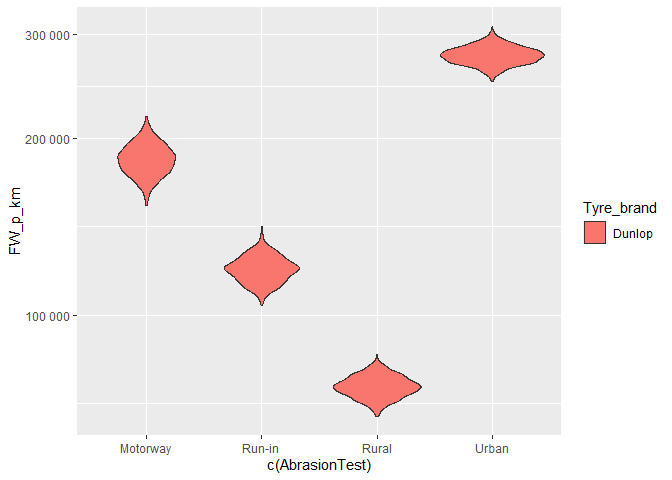
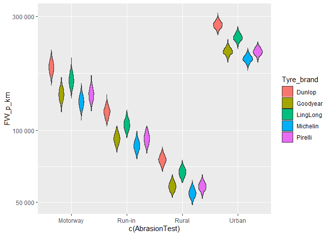
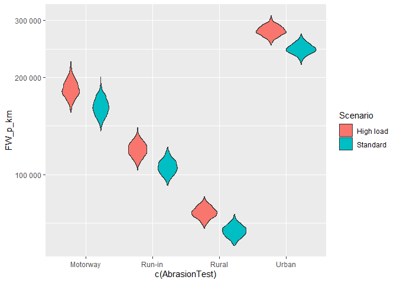

# Estimating the tyre abrasion coefficient

1.  First data on the maneuvers, track, vehicle, tyres and abrassion
    measurements need to be combined into a dataset for use further
    calculations. Then the following calculations are performed:
2.  Total Force at all the tyres together
3.  Total Slip at all tyres together
4.  Calculate total Friction Work for the relevant abrassion measurement
5.  Calculate the Abrasion Coefficient

## 1. Data prepartion

    library(tidyverse)

    ## Warning: package 'ggplot2' was built under R version 4.3.2

    ## Warning: package 'tidyr' was built under R version 4.3.2

    ## Warning: package 'readr' was built under R version 4.3.2

    ## Warning: package 'dplyr' was built under R version 4.3.2

    ## Warning: package 'stringr' was built under R version 4.3.2

    ## ── Attaching core tidyverse packages ──────────────────────── tidyverse 2.0.0 ──
    ## ✔ dplyr     1.1.4     ✔ readr     2.1.5
    ## ✔ forcats   1.0.0     ✔ stringr   1.5.1
    ## ✔ ggplot2   3.4.4     ✔ tibble    3.2.1
    ## ✔ lubridate 1.9.3     ✔ tidyr     1.3.1
    ## ✔ purrr     1.0.2     
    ## ── Conflicts ────────────────────────────────────────── tidyverse_conflicts() ──
    ## ✖ dplyr::filter() masks stats::filter()
    ## ✖ dplyr::lag()    masks stats::lag()
    ## ℹ Use the conflicted package (<http://conflicted.r-lib.org/>) to force all conflicts to become errors

    source("R/Base functions.R")
    local_path <- "data/TWP emission data_IDIADA_v01.xlsx"

    n.Runs = 1000 # for clearly uncertrain variables, amount of values to use

    Maneuver_data <- readxl::read_excel(path = local_path, sheet = "Maneuver data")

    AllData <- 
      Maneuver_data |> 
      full_join(readxl::read_excel(path = local_path, sheet = "Sector data")) |> 
      cross_join(readxl::read_excel(path = local_path, sheet = "Vehicle data")) |> 
      full_join(readxl::read_excel(path = local_path, sheet = "Tyre_data"),relationship = "many-to-many") |> 
      full_join(readxl::read_excel(path = local_path, sheet = "Test data"))

    ## Joining with `by = join_by(Track, `Sector number`)`
    ## Joining with `by = join_by(Vehicle_class)`
    ## Joining with `by = join_by(Track, `Test section`)`

    Constants <- readxl::read_excel(path = local_path, sheet = "Constants")
    # str(AllData)
    # AllData$Vehicle_class

    Tyre_Label_table_fuelEff =    readxl::read_excel(
      "data/Tyre_conversion.xlsx", 
      sheet = "Label fuel efficiency class",
      skip=1)
    Tyre_Label_table_wetgrip =    readxl::read_excel(
      "data/Tyre_conversion.xlsx", 
      sheet = "Label wet grip class",
      skip=1)

    AllData <-
      AllData |> 
      rowwise() |>  
      mutate(
        RolCoef_min =  fRolCoef_Tlabel(
          Label_fuelleff =
            `Fuel efficiency class`,
          Vehicle_class = Vehicle_class,
          Tyre_Label_table =
            Tyre_Label_table_fuelEff
        )$min,
        RolCoef_max = fRolCoef_Tlabel(
          Label_fuelleff =
            `Fuel efficiency class`,
          Vehicle_class = Vehicle_class,
          Tyre_Label_table = Tyre_Label_table_fuelEff
        )$max,
        GripIndex_min  = fGripIndex_Tlabel(
          Label_wetgrip = `Wet grip class`,
          Vehicle_class = Vehicle_class,
          Tyre_Label_table = Tyre_Label_table_wetgrip
        )$min,
        GripIndex_max = fGripIndex_Tlabel(
          Label_wetgrip = `Wet grip class`,
          Vehicle_class = Vehicle_class,
          Tyre_Label_table = Tyre_Label_table_wetgrip
        )$max
      )
    # create n.Runs number of Rol Coefficients based on uncertainty of tyre label rol coefficient classes
    AllData <-
      AllData |> mutate(
        RolCoef_u = list(runif(n.Runs, RolCoef_min, RolCoef_max)),
        GripIndex_u = list(runif(n.Runs, GripIndex_min, GripIndex_max)),
        
        x_correct_mu_max_track_u =
          switch(
            Underground,
            "Wet asphalt" = 1,
            "Dry asphalt" = list(
              runif(
                n.Runs,
                min =  Constants |>
                  filter(Name == "x_correct_mu_max_wet2dry_min") |>
                  pull(value),
                max =  Constants |>
                  filter(Name == "x_correct_mu_max_wet2dry_max") |>
                  pull(value)
              )
            )
          ),
        
        optimal_slip_ratio_track_u =
          switch(
            Underground,
            "Wet asphalt" = list(
              runif(
                n.Runs,
                min =  Constants |>
                  filter(Name == "optimal_slip_wet_min") |>
                  pull(value),
                max =  Constants |>
                  filter(Name == "optimal_slip_wet_max") |>
                  pull(value)
              )
            ),
            "Dry asphalt" = list(
              runif(
                n.Runs,
                min =  Constants |>
                  filter(Name == "optimal_slip_dry_min") |>
                  pull(value),
                max =  Constants |>
                  filter(Name == "optimal_slip_dry_max") |>
                  pull(value)
              )
            )
          )
      )

    ### end data prep ###

## 2. Total Force

Longitutidal and Lattidunal forces are calculated

    AllData <-
      AllData |> mutate(
        ForceDecelLong =
          list(
            f_decel_long_force(
              c_roll = RolCoef_u,
              m_vehicle = `Mass (kg)`,
              grav_constant = Constants |>
                filter(Name == "grav_constant") |> pull(value),
              c_drag = `Aero_drag_coef (-)`,
              A_vehicle = `Surface_Area (m2)`,
              rho_air = Constants |>
                filter(Name == "rho_air") |> pull(value),
              v_start_decel = `Start speed (m/s)`,
              v_end_decel = `End speed (m/s)`,
              v_wind = v_wind,
              alpha_slope = `Longitudinal slope (%)` / 100,
              m_rotate = runif(
                n.Runs,
                Constants |>
                  filter(Name == "min_rotating_fraction") |> pull(value),
                Constants |>
                  filter(Name == "max_rotating_fraction") |> pull(value)
              ),
              c_decel = `Deceleration constant (m.s^-2)`
            )
          ),
        ForceAccelLong =
          list(
            f_accel_long_force(
              c_roll = RolCoef_u,
              m_vehicle = `Mass (kg)`,
              grav_constant = Constants |>
                filter(Name == "grav_constant") |> pull(value),
              c_drag = `Aero_drag_coef (-)`,
              A_vehicle = `Surface_Area (m2)`,
              rho_air = Constants |>
                filter(Name == "rho_air") |> pull(value),
              v_start_accel = `Start speed (m/s)`,
              v_end_accel = `End speed (m/s)`,
              v_wind = v_wind,
              alpha_slope = `Longitudinal slope (%)` / 100,
              m_rotate = runif(
                n.Runs,
                Constants |>
                  filter(Name == "min_rotating_fraction") |> pull(value),
                Constants |>
                  filter(Name == "max_rotating_fraction") |> pull(value)
              ),
              c_accel = `Acceleration constant (m.s^-2)`
            )
          ),
        ForceConstLong =
          list(
            f_const_speed_long_force(
              c_roll = RolCoef_u,
              m_vehicle = `Mass (kg)`,
              grav_constant = Constants |>
                filter(Name == "grav_constant") |> pull(value),
              c_drag = `Aero_drag_coef (-)`,
              A_vehicle = `Surface_Area (m2)`,
              rho_air = Constants |>
                filter(Name == "rho_air") |> pull(value),
              v_vehicle = `End speed (m/s)`,
              v_wind = `v_wind`,
              alpha_slope = `Longitudinal slope (%)` /100)
          ),
        ForceCornLatt_M =
          list(
            f_lat_force( m_vehicle = `Mass (kg)`,
                         grav_constant = Constants |> 
                           filter(Name == "grav_constant") |> pull(value),
                         r_corner = `Corner radius (m)`,
                         alpha_bank_slope = `Latitudinal slope (%)` / 100,
                         v_vehicle = mean(`Start speed (m/s)`,`End speed (m/s)`)) 
          ),
        ForceCornLatt_C =
          list(
            f_lat_force( m_vehicle = `Mass (kg)`,
                         grav_constant = Constants |> 
                           filter(Name == "grav_constant") |> pull(value),
                         r_corner = `Corner radius (m)`,
                         alpha_bank_slope = `Latitudinal slope (%)` / 100,
                         v_vehicle = `End speed (m/s)`) 
          )
      )

## 3. Total Slip

    # add slipt to the data:

    AllData <-
      AllData |> mutate(
        SlipDecelLong =
          list(
            f_decel_long_slip(c_roll = RolCoef_u, 
                              m_vehicle = `Mass (kg)`, 
                              grav_constant = Constants |> 
                                filter(Name == "grav_constant") |> pull(value), 
                              c_drag = `Aero_drag_coef (-)`, 
                              A_vehicle = `Surface_Area (m2)`,
                              rho_air = Constants |> 
                                filter(Name == "rho_air") |> pull(value),
                              v_start_decel = `Start speed (m/s)`, 
                              v_end_decel = `End speed (m/s)`, 
                              v_wind = `v_wind`,
                              alpha_slope = `Longitudinal slope (%)`/100, 
                              m_rotate = runif(n.Runs,
                                               Constants |> 
                                                 filter(Name == "min_rotating_fraction") |> 
                                                 pull(value),
                                               Constants |> 
                                                 filter(Name == "max_rotating_fraction") |> 
                                                 pull(value)), 
                              c_decel = `Deceleration constant (m.s^-2)`, 
                              optimal_slip_ratio_tyre_track = optimal_slip_ratio_track_u,
                              grip_index_tyre = GripIndex_u,
                              wet_mu_max_ref_tyre = Constants |>
                                filter(Name == "mu_max_ref_tyre_wet") |> pull(value),
                              x_correct_mu_max_track = x_correct_mu_max_track_u,
                              c_brake_ref_tyre_wet = Constants |> 
                                filter(Name == "c_brake_ref_tyre_wet") |> pull(value)
            ) 
          ),
        SlipAccelLong= list(
          f_accel_long_slip(c_roll = RolCoef_u, 
                            m_vehicle = `Mass (kg)`, 
                            grav_constant = Constants |> 
                              filter(Name == "grav_constant") |> pull(value), 
                            c_drag = `Aero_drag_coef (-)`, 
                            A_vehicle = `Surface_Area (m2)`, 
                            rho_air = Constants |> 
                              filter(Name == "rho_air") |> pull(value),
                            v_start_accel = `Start speed (m/s)`, 
                            v_end_accel = `End speed (m/s)`, 
                            v_wind = v_wind, 
                            alpha_slope = `Longitudinal slope (%)`/100, 
                            m_rotate = runif(n.Runs,
                                             Constants |> 
                                               filter(Name == "min_rotating_fraction") |> 
                                               pull(value),
                                             Constants |> 
                                               filter(Name == "max_rotating_fraction") |> 
                                               pull(value)), 
                            c_accel = `Acceleration constant (m.s^-2)`, 
                            optimal_slip_ratio_tyre_track = optimal_slip_ratio_track_u,
                            grip_index_tyre = GripIndex_u, 
                            wet_mu_max_ref_tyre = Constants |> 
                              filter(Name == "mu_max_ref_tyre_wet") |> pull(value),
                            x_correct_mu_max_track = x_correct_mu_max_track_u)
        ),
        SlipConstLong = 
          list(
            f_const_speed_long_slip(c_roll = RolCoef_u, 
                                    m_vehicle = `Mass (kg)`, 
                                    m_rotate = runif(n.Runs,
                                                     Constants |> 
                                                       filter(Name == "min_rotating_fraction") |> 
                                                       pull(value),
                                                     Constants |> 
                                                       filter(Name == "max_rotating_fraction") |> 
                                                       pull(value)),
                                    grav_constant = Constants |> 
                                      filter(Name == "grav_constant") |> pull(value), 
                                    c_drag = `Aero_drag_coef (-)`, 
                                    A_vehicle = `Surface_Area (m2)`, 
                                    rho_air = Constants |> 
                                      filter(Name == "rho_air") |> pull(value), 
                                    v_vehicle = `End speed (m/s)`, 
                                    v_wind = `v_wind`,
                                    alpha_slope = `Longitudinal slope (%)`/100,
                                    wet_mu_max_ref_tyre = Constants |> 
                                      filter(Name == "mu_max_ref_tyre_wet") |> pull(value), 
                                    optimal_slip_ratio_tyre_track = optimal_slip_ratio_track_u,
                                    grip_index_tyre = GripIndex_u, 
                                    c_brake_ref_tyre_wet = Constants |> 
                                      filter(Name == "c_brake_ref_tyre_wet") |> pull(value), 
                                    x_correct_mu_max_track = x_correct_mu_max_track_u)
          ),
        SlipCornLatt_M =
          list(
            f_lat_slip(m_vehicle = `Mass (kg)`, 
                       v_vehicle = mean(`Start speed (m/s)`,
                                        `End speed (m/s)`), 
                       r_corner = `Corner radius (m)`, 
                       grav_constant = Constants |> 
                         filter(Name == "grav_constant") |> pull(value),
                       alpha_bank_slope = `Latitudinal slope (%)`/100, 
                       optimal_slip_ratio_tyre_track = optimal_slip_ratio_track_u,
                       grip_index_tyre = GripIndex_u, 
                       wet_mu_max_ref_tyre = Constants |> 
                         filter(Name == "mu_max_ref_tyre_wet") |> pull(value), 
                       x_correct_mu_max_track = x_correct_mu_max_track_u)
          ),
        SlipCornLatt_C =
          list(
            f_lat_slip(m_vehicle = `Mass (kg)`, 
                       v_vehicle = `End speed (m/s)`, 
                       r_corner = `Corner radius (m)`, 
                       grav_constant = Constants |> 
                         filter(Name == "grav_constant") |> pull(value),
                       alpha_bank_slope = `Latitudinal slope (%)`/100, 
                       optimal_slip_ratio_tyre_track = optimal_slip_ratio_track_u,
                       grip_index_tyre = GripIndex_u, 
                       wet_mu_max_ref_tyre = Constants |> 
                         filter(Name == "mu_max_ref_tyre_wet") |> pull(value), 
                       x_correct_mu_max_track = x_correct_mu_max_track_u)
          ) 
      )

## 4. Total Friction Work

    AllData_fw <- 
      AllData |> mutate(
        DistanceManAccel =
          f_accel_distance(v_start = `Start speed (m/s)`,
                           v_end = `End speed (m/s)`,
                           c_accel = `Acceleration constant (m.s^-2)`),
        DistanceManDecel = 
          f_decel_distance(v_start = `Start speed (m/s)`,
                           v_end = `End speed (m/s)`,
                           c_decel = `Deceleration constant (m.s^-2)`),
        DistanceCorn = f_corner_distance(r_corner = `Corner radius (m)`,
                                         corner_angle = `Corner angle (degrees)`),
      )  |> mutate(DistanceConst = `Distance (m)`-
                     DistanceManAccel*`Maneuver repeats` - 
                     DistanceManDecel*`Maneuver repeats`,
                   FWAccelLong = list(ForceAccelLong*SlipAccelLong*DistanceManAccel*`Maneuver repeats`),
                   FWDecelLong = list(ForceDecelLong*SlipDecelLong*DistanceManDecel*`Maneuver repeats`),
                   FWConstLong = list(ForceConstLong*SlipConstLong*DistanceConst),
                   FWLat = list(
                     SlipCornLatt_M*ForceCornLatt_M*(DistanceManAccel+DistanceManDecel) +
                       SlipCornLatt_C*ForceCornLatt_C*DistanceConst),
                   FricWork_p_sector = list((FWAccelLong+FWDecelLong+FWConstLong+FWLat)) # calculate FW per sector
                   
      )

    FWtotals <-
      AllData_fw |> ungroup() |> 
      group_by(AbrasionTest,Tyre_brand,`Vehicle type`,Scenario,`Sector number`,`Maneuver number`,`Test section`) |> 
      unnest(FricWork_p_sector) #get the uncertainty runs to the tibble for summarise

    length(FWtotals$Track)

    ## [1] 1920000

    FWtotals <- FWtotals |>  mutate(RUN = rep(1:1000)) # give code to each run

    FWtotals <-
      FWtotals |> ungroup() |> 
      group_by(AbrasionTest,Tyre_brand,`Vehicle type`,Scenario,`Test section`,RUN,`Total distance (km)`, `Number of laps`) |> 
      summarise(sector_count = n(),
                PartFrictionWork = sum(FricWork_p_sector)) |> # sum up all friction work per test section(for maneuvers?) (e.g. rural 60 kph)
      mutate(SectionFrictionWork = PartFrictionWork *`Number of laps`) # multiple test section with number of laps to get total FW per test per section

    ## `summarise()` has grouped output by 'AbrasionTest', 'Tyre_brand', 'Vehicle
    ## type', 'Scenario', 'Test section', 'RUN', 'Total distance (km)'. You can
    ## override using the `.groups` argument.

    # write.csv(FWtotals, "FWtotals2.csv")

    FWtotals <-
      FWtotals |>  ungroup() |> 
      group_by(AbrasionTest,Tyre_brand,`Vehicle type`,Scenario,RUN) |> 
      summarise(Section_count = n(),
                TotFrictionWork = sum(SectionFrictionWork), # sum the test sections to get total FW for the whole arbasion test
                Test_Distance_km = sum(`Total distance (km)`)) |> # sum up also the distance of each test section to get total distace driven in each test.
      mutate(FW_p_km = TotFrictionWork/Test_Distance_km) # devide total FW per test by the distance driven per test

    ## `summarise()` has grouped output by 'AbrasionTest', 'Tyre_brand', 'Vehicle
    ## type', 'Scenario'. You can override using the `.groups` argument.

    library(ggplot2)

    plotdata <- FWtotals |> filter(Tyre_brand == "Dunlop" & Scenario == "Standard") # plot FW for each test (J per km)

    plot <- ggplot(plotdata, aes(x = c(AbrasionTest), y = FW_p_km, fill=Tyre_brand )) +
      geom_violin()
    plot+  scale_y_log10(labels = scales::number_format())

    # boxplot(FWtotals)

    plotdata <- FWtotals |> filter( Scenario == "Standard") # plot FW for each test (J per km)

    plot <- ggplot(plotdata, aes(x = c(AbrasionTest), y = FW_p_km, fill=Tyre_brand )) +
      geom_violin()
    plot+  scale_y_log10(labels = scales::number_format())

    plotdata <- FWtotals |> filter( Scenario == "High load"|Scenario == "Standard",Tyre_brand == "LingLong") # plot FW for each test (J per km)

    plot <- ggplot(plotdata, aes(x = c(AbrasionTest), y = FW_p_km, fill=Scenario )) +
      geom_violin()
    plot+  scale_y_log10(labels = scales::number_format())

    ### end of FW

## 5. Abrasion Coefficient

    # read in and prepare abrasion rate measurement data
    IDIADAwear <- readxl::read_excel(path = local_path, sheet = "Abrasion", skip = 9)

    ## New names:
    ## • `` -> `...1`
    ## • `` -> `...2`

    #provide proper column names
    names(IDIADAwear)[c(1,2)] <- c("Tyre_brand","Wheel")

    # extend Tyre to all its rows
    for(i in 1:nrow(IDIADAwear)){
      if(is.na(IDIADAwear$Tyre_brand[i])){
        IDIADAwear$Tyre_brand[i] <- IDIADAwear$Tyre_brand[i-1]
      }
    }

    #What?
    IDIADAwear$C0 <- NULL

    # clean up rows with NA and calculated data
    IDIADAwear <- 
      IDIADAwear |> separate(col = Tyre_brand,
                             into =c("Tyre_brand", "Scenario"),
                             sep = "     ")|> 
      filter(!is.na(Wheel)) |> 
      filter(Wheel != "Total") |> 
      filter( Wheel != "Front") |> 
      filter(Wheel != "Rear") 

    ## Warning: Expected 2 pieces. Missing pieces filled with `NA` in 39 rows [1, 2, 3, 4, 5,
    ## 6, 7, 8, 25, 26, 27, 28, 29, 30, 31, 32, 33, 34, 35, 36, ...].

    #Track to long format
    WearAsLong <- tidyr::pivot_longer(IDIADAwear, 
                                      cols = names(IDIADAwear)[!names(IDIADAwear) %in% c("Tyre_brand","Wheel","Scenario")],
                                      names_to = c("Shift","AbrasionTest"),
                                      names_sep = "-",
                                      values_to = "Abrasion_mg_km")

    WearAsLong <-
      WearAsLong |> mutate(
        AbrasionTest = 
          AbrasionTest |> recode(
            "Runin" = "Run-in",
            "Rur" = "Rural",
            "Mot" = "Motorway",
            "Ur" = "Urban"
          ),
        Scenario = Scenario |> 
          replace_na("Standard")
      )

    WearAsLong <- # aggregate data per wheel to total per vehicle
      WearAsLong |> ungroup() |> 
      group_by(Tyre_brand ,Scenario ,Shift , AbrasionTest) |> 
      summarise(Abrasion_mg_km = sum(Abrasion_mg_km),
                nWheels = n())

    ## `summarise()` has grouped output by 'Tyre_brand', 'Scenario', 'Shift'. You can
    ## override using the `.groups` argument.

    CombinedFW_TW <- 
      left_join(WearAsLong,FWtotals, relationship = "many-to-many") |> 
      mutate(AbrasionCoeff = Abrasion_mg_km / FW_p_km) |> # Calculate the abrasion coefficient
      mutate(TestScenName = paste(Tyre_brand, Scenario, sep = "-"))

    ## Joining with `by = join_by(Tyre_brand, Scenario, AbrasionTest)`

    # figure of tyre fricction work

    plot_theme = theme(
      axis.title.x = element_text(size = 16),
      axis.text = element_text(size = 14), 
      axis.title.y = element_text(size = 16),
      plot.background = element_rect(fill = 'white'),
      panel.background = element_rect(fill = 'white'),
      panel.grid.major = element_blank(),
      panel.grid.minor = element_blank(),
      axis.line = element_line(color='black'),
      plot.margin = margin(1, 1, 1, 1, "cm")
      #panel.grid.major = element_line(colour = "grey",size=0.25)
    )

    FW_plot <- ggplot(filter(CombinedFW_TW, Scenario == "Standard"), 
                      aes(x = c(AbrasionTest), y = FW_p_km, fill=reorder(TestScenName, FW_p_km))) +
      geom_violin()+
      # theme(legend.position="none")+
      # scale_y_log10(labels = scales::number_format()) +             # Log-transform y-axis
      labs(x = "Abrasion test scenario", y = "Friction Work (J/km)") +                   # Adjust labels
      # coord_flip() +
      plot_theme +
      labs(fill = "Tyre")
    FW_plot

    ggsave(paste0("figures/FrictionWork_AbrasionT_Tyre",format(Sys.time(),'%Y%m%d'),".png"),
           width = 12, height = 6)

    # Figure of abrasion measurements per tyre type tested
    plotdata <- CombinedFW_TW |> 
      filter( Scenario == "Standard") |> ungroup() |> 
      group_by(Tyre_brand ,Scenario , Shift, AbrasionTest , `Vehicle type`,TestScenName) |> 
      summarise(Abrasion_mg_km=mean(Abrasion_mg_km),
                n=n(),
                sd=sd(Abrasion_mg_km))

    ## `summarise()` has grouped output by 'Tyre_brand', 'Scenario', 'Shift',
    ## 'AbrasionTest', 'Vehicle type'. You can override using the `.groups` argument.

    plotdata |> ungroup() |> 
      group_by(Scenario , AbrasionTest , `Vehicle type`) |> 
      summarise(            min = min(Abrasion_mg_km),
                            p5 = quantile(Abrasion_mg_km, probs=0.05),
                            AvgAbrasion_mg_km = mean(Abrasion_mg_km),
                            p50 = quantile(Abrasion_mg_km, probs=0.5),
                            p95 = quantile(Abrasion_mg_km, probs=0.95),
                            max = max(Abrasion_mg_km),
                            
                            n_abr = n())

    ## `summarise()` has grouped output by 'Scenario', 'AbrasionTest'. You can
    ## override using the `.groups` argument.

    ## # A tibble: 4 × 10
    ## # Groups:   Scenario, AbrasionTest [4]
    ##   Scenario AbrasionTest `Vehicle type`   min    p5 AvgAbrasion_mg_km   p50   p95
    ##   <chr>    <chr>        <chr>          <dbl> <dbl>             <dbl> <dbl> <dbl>
    ## 1 Standard Motorway     Esccape Kuga    343.  377.              545.  545.  820.
    ## 2 Standard Run-in       Esccape Kuga    122.  124.              198.  206.  267.
    ## 3 Standard Rural        Esccape Kuga    251.  269.              360.  345.  467.
    ## 4 Standard Urban        Esccape Kuga    711.  842.             1503. 1415. 2166.
    ## # ℹ 2 more variables: max <dbl>, n_abr <int>

    ggplot(plotdata, 
           aes(x = c(AbrasionTest), y = Abrasion_mg_km, colour=reorder(TestScenName, Abrasion_mg_km) )) +
      geom_boxplot() + 
      geom_point(aes(colour = reorder(TestScenName, Abrasion_mg_km)), 
                 position = position_jitterdodge(jitter.width = 0.1,
                                                 dodge.width = 0.75))+
      labs(x = "Abrasion test scenario", y = "Abrasion rate (mg/km)", fill = "Tyre", colour = "Tyre") +                   # Adjust labels
      
      plot_theme 

    ggsave(paste0("figures/AbrasionRate_AbrasionT_Tyre",format(Sys.time(),'%Y%m%d'),".png"),
           width = 12, height = 6)

    ACplot1 <- ggplot(filter(CombinedFW_TW, Scenario == "Standard"), 
                      aes(x = c(AbrasionTest), y = AbrasionCoeff, fill=reorder(TestScenName, AbrasionCoeff) )) +
      geom_boxplot() +
      geom_point(aes(colour = reorder(TestScenName, AbrasionCoeff)), 
                 position = position_jitterdodge(jitter.width = 0.05,
                                                 dodge.width = 0.75))+
      labs(x = "Abrasion test scenario", y = "Abrasion Coeff (mg/J)", fill = "Tyre", colour = "Tyre") +                   # Adjust labels
      
      plot_theme 
    ACplot1

    ggsave(paste0("figures/AbrasionCoef1_AbrasionT_Tyre",format(Sys.time(),'%Y%m%d'),".png"),
           width = 12, height = 6)

    ACplot2 <- ggplot(filter(CombinedFW_TW, Scenario == "Standard"), 
                      aes(x = c(AbrasionTest), y = AbrasionCoeff, fill=reorder(TestScenName, AbrasionCoeff) )) +
      geom_boxplot() +
      # geom_point(aes(colour = TestScenName), position = position_jitterdodge(jitter.width = 0.05,
      #                                                                      dodge.width = 0.75))+
      labs(x = "Abrasion test scenario", y = "Abrasion Coeff (mg/J)", fill = "Tyre", colour = "Tyre") +                   # Adjust labels
      
      plot_theme 
    ACplot2

    ggsave(paste0("figures/AbrasionCoef2_AbrasionT_Tyre",format(Sys.time(),'%Y%m%d'),".png"),
           width = 12, height = 6)

    ####### Figures with all scenario's ########

    FW_plot <- ggplot(CombinedFW_TW, 
                      aes(x = c(AbrasionTest), y = FW_p_km, fill=reorder(TestScenName, FW_p_km))) +
      geom_violin()+
      # theme(legend.position="none")+
      # scale_y_log10(labels = scales::number_format()) +             # Log-transform y-axis
      labs(x = "Abrasion test scenario", y = "Friction Work (J/km)") +                   # Adjust labels
      # coord_flip() +
      plot_theme +
      labs(fill = "Tyre")
    FW_plot

    ggsave(paste0("figures/FrictionWork_AbrasionT_Tyre_HLT",format(Sys.time(),'%Y%m%d'),".png"),
           width = 12, height = 6)

    plot

    # Figure of abrasion measurements per tyre type tested
    plotdata <- CombinedFW_TW |>  ungroup() |> 
      group_by(Tyre_brand ,Scenario , Shift, AbrasionTest , `Vehicle type`,TestScenName) |> 
      summarise(Abrasion_mg_km=mean(Abrasion_mg_km),
                n=n(),
                sd=sd(Abrasion_mg_km))

    ## `summarise()` has grouped output by 'Tyre_brand', 'Scenario', 'Shift',
    ## 'AbrasionTest', 'Vehicle type'. You can override using the `.groups` argument.

    ggplot(plotdata, 
           aes(x = c(AbrasionTest), y = Abrasion_mg_km, colour=reorder(TestScenName, Abrasion_mg_km) )) +
      geom_boxplot() + 
      geom_point(aes(colour = reorder(TestScenName, Abrasion_mg_km)), 
                 position = position_jitterdodge(jitter.width = 0.1,
                                                 dodge.width = 0.75))+
      labs(x = "Abrasion test scenario", y = "Abrasion rate (mg/km)", fill = "Tyre", colour = "Tyre") +                   # Adjust labels
      
      plot_theme 

    ggsave(paste0("figures/AbrasionRate_AbrasionT_Tyre_HLT",format(Sys.time(),'%Y%m%d'),".png"),
           width = 12, height = 6)

    ACplot1 <- ggplot(CombinedFW_TW, 
                      aes(x = c(AbrasionTest), y = AbrasionCoeff, fill=reorder(TestScenName, AbrasionCoeff) )) +
      geom_boxplot() +
      geom_point(aes(colour = reorder(TestScenName, AbrasionCoeff)), 
                 position = position_jitterdodge(jitter.width = 0.05,
                                                 dodge.width = 0.75))+
      labs(x = "Abrasion test scenario", y = "Abrasion Coeff (mg/J)", fill = "Tyre", colour = "Tyre") +                   # Adjust labels
      
      plot_theme 
    ACplot1

    ggsave(paste0("figures/AbrasionCoef1_AbrasionT_Tyre_HLT",format(Sys.time(),'%Y%m%d'),".png"),
           width = 12, height = 6)

    ACplot2 <- ggplot(CombinedFW_TW, 
                      aes(x = c(AbrasionTest), y = AbrasionCoeff, fill=reorder(TestScenName, AbrasionCoeff) )) +
      geom_boxplot() +
      # geom_point(aes(colour = TestScenName), position = position_jitterdodge(jitter.width = 0.05,
      #                                                                      dodge.width = 0.75))+
      labs(x = "Abrasion test scenario", y = "Abrasion Coeff (mg/J)", fill = "Tyre", colour = "Tyre") +                   # Adjust labels
      
      plot_theme 
    ACplot2

    ggsave(paste0("figures/AbrasionCoef2_AbrasionT_Tyre_HLT",format(Sys.time(),'%Y%m%d'),".png"),
           width = 12, height = 6)
