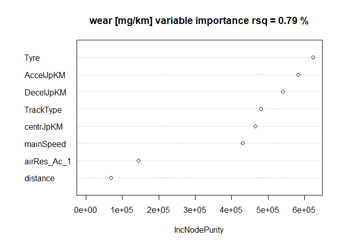

### Relate forces to wear

Trying machine learning (random forest) to test the relation between
forces on a car during a length of track and the amount of wear on the
tyres, as measured by IDIADA. First set constants and prepare to
calculate the forces given the track description. Also define a helper
function. Roll coefficients of the tyres are mostly mission, the average
velocity per section of the track is used as a proxy for the roll
resistance. The end results are the aggragations of all sections for
each track. Also the total distance is needed per section.

    #ThisData
    m_vehicle = 1644
    heavy_veh = 1868
    #Vehicle surface area in m^2
    A_vehicle = 2.629
    #Vehicle aerodynamic drag coefficient
    c_drag = 0.347
    ### Gravitational constant in m.s^-2
    grav_constant = 9.81
    ## Landscape data ##
    ###Density of air in kg.m^-3
    rho_air = 1.205

    #'@param v_start Velocity at the start of the section of the track (m/s)
    #'@param v_end Acceleration time (s)
    #'@param dv Acceleration/Descelaration constant of the vehicle (m/s^2)
    dv_distance <- function(v_start, v_end, dv) {
      dv_time <- abs((v_start-v_end)/dv)
      v_start*dv_time+1/2*dv*dv_time^2
    }

    AirResist <- function (c_drag,
              A_vehicle,
              rho_air,
              velocity_kmh
              # v_wind #no data; circuit goes 360.. neglected
            ) {
      pmax(0, c_drag * A_vehicle * rho_air * velocity_kmh^2)
    }

    TrackFilename <- "data/hiddendata/IDIDAsTables.xlsx" #/rivm/r/E121554 LEON-T/03 - uitvoering WP3/
    Tracks <- openxlsx::getSheetNames(TrackFilename)
    #First separate General and read them all
    general <- openxlsx::read.xlsx(xlsxFile = TrackFilename, sheet = "general")
    TracksData <- list()
    TrackSumData <- list()
    for (Track in Tracks[Tracks != "general"]) {#Track = "rural5"
      TracksData[[Track]] <- openxlsx::read.xlsx(TrackFilename, sheet = Track)
      #km/h to m/s conversion
      TracksData[[Track]]$velocity <- TracksData[[Track]]$velocity_kmh * 1000 / 3600
      TracksData[[Track]]$start_velocity <- TracksData[[Track]]$start_velocity_kmh * 1000 / 3600
    }
    #TracksData
    finalNames <- c("distance", "velocity", "start_velocity", "corner_radius" )
    for (TrackName in names(TracksData)) {#TrackName = "urban2"
      Track <- TracksData[[TrackName]]
      #remove testTot, if needed
      if ("testTot" %in% names(Track)) {
        Track <- Track[,names(Track)[names(Track)!="testTot"]]
      }
      #1 expand sectionRepeat, if needed
      if ("sectionRepeat" %in% names(Track)) {
        Track$sectionRepeat[is.na(Track$sectionRepeat)] <- 1
        SepRows <- lapply(1:nrow(Track), function(numline){ #numline = 1
         cbind(as.data.frame(lapply(Track[numline,names(Track)[names(Track)!="sectionRepeat"]], rep, Track[numline,"sectionRepeat"]))) #
        })
        Track <- do.call(rbind,SepRows)
      }
      #2 repeat df, re-bind 
      #Add0s <- T # add section to start and end at v = 0
      TotTrack <- cbind(as.data.frame(lapply(Track, rep, general$repeats[general$TrackName == TrackName]))) #
      # A exception 5*6 = 27 corrected in the last four rows for "rural6"
      if (TrackName == "rural6"){
        Aggr4 <- aggregate(distance ~ corner_radius + velocity , data = tail(TotTrack, 3), FUN = sum)
        Aggr4$start_velocity = Aggr4$velocity
        TotTrack <- rbind(head(TotTrack[, finalNames], nrow(TotTrack) - 3),
                          Aggr4[, finalNames])
      } else {
        TotTrack <- TotTrack[,finalNames]
      }
      #3 acceleration decel distances; begin and end at 0
      accellDist <- dv_distance(c(0,TotTrack$start_velocity), 
                                c(TotTrack$start_velocity[1], TotTrack$velocity), 
                                general$accel_ms2[general$TrackName == TrackName])
      StartNext <- c(TotTrack$start_velocity[-1], 0)
      descelDist <-  dv_distance(c(TotTrack$velocity), 
                                 StartNext, 
                                 - general$decel_ms2[general$TrackName == TrackName])
      #correct and split for ascel distances
      nwAscelRows <- which(accellDist[-1] > 0)
      if (length(nwAscelRows) > 0) {
        AscelDf <- data.frame(
          distance = accellDist[-1][nwAscelRows],
          velocity = (TotTrack$velocity[nwAscelRows] + TotTrack$start_velocity[nwAscelRows]) / 2, #mean
          start_velocity = TotTrack$start_velocity[nwAscelRows],
          corner_radius = TotTrack$corner_radius[nwAscelRows],
          centrfac = 0, # no ascel in corners
          accelleration = general$accel_ms2[general$TrackName == TrackName]
        )
        TotTrack$distance[nwAscelRows] <- TotTrack$distance[nwAscelRows] - AscelDf$distance
      } else AscelDf <- NULL
      nwDecelRows <-  which(descelDist > 0)
      #the last is not in TotTrack, so
      nwDecelRows <- nwDecelRows[nwDecelRows != nrow(TotTrack)]
      if (length(nwDecelRows) > 0) {
        DecelDf <- data.frame(
          distance = descelDist[nwDecelRows],
          velocity = (TotTrack$velocity[nwDecelRows] + TotTrack$start_velocity[nwDecelRows + 1]) / 2, #mean
          start_velocity = TotTrack$start_velocity[nwDecelRows],
          corner_radius = TotTrack$corner_radius[nwDecelRows],
          centrfac = 0, # no descel in corners
          accelleration = -general$decel_ms2[general$TrackName == TrackName]
        )
        TotTrack$distance[nwDecelRows] <- TotTrack$distance[nwDecelRows] - DecelDf$distance
      } else DecelDf <- NULL
      TotTrack$centrfac <- ifelse(TotTrack$corner_radius == 0, 0, TotTrack$velocity^2 / TotTrack$corner_radius)
      TotTrack$accelleration <- 0
      SectTrack <- rbind(
        TotTrack[,c(finalNames, "accelleration", "centrfac")], 
        AscelDf[,c(finalNames, "accelleration", "centrfac")], 
        DecelDf[,c(finalNames, "accelleration", "centrfac")]
      )
      #check!
      # :) sum(SectTrack$distance)
      
      row1 <- data.frame (
        distance = accellDist[1],
        velocity = TotTrack$velocity[1] / 2, #mean
        start_velocity = 0,
        centrfac = 0,
        corner_radius = 0,
        accelleration = general$accel_ms2[general$TrackName == TrackName]
      )
      lastrow <- data.frame (
        distance = tail(descelDist,1),
        velocity = tail(TotTrack$velocity, 1) / 2, #mean
        start_velocity = tail(TotTrack$velocity, 1),
        corner_radius = 0,
        centrfac = 0,
        accelleration = -general$decel_ms2[general$TrackName == TrackName]
      )
      SectTrack <- rbind(
        row1[,names(SectTrack)],
        SectTrack,
        lastrow[,names(SectTrack)]
      )
      SumTrack <- aggregate(distance ~ velocity + centrfac + accelleration, 
                            data = SectTrack,
                            FUN = sum)
      SumTrack$Track <- TrackName
      TrackSumData[[TrackName]] <- SumTrack
    }
    TrackSum <- do.call(rbind, TrackSumData)
    DistSum <- aggregate(distance~Track, data = TrackSum, FUN = sum)
    TrackSum

    ##            velocity    centrfac accelleration     distance   Track
    ## urban1.1   2.777778   0.0000000         -1.11     13.90279  urban1
    ## urban1.2   5.555556  -5.2759312          0.00    210.00000  urban1
    ## urban1.3   5.555556  -1.6159266          0.00   1560.00000  urban1
    ## urban1.4   5.555556   0.0000000          0.00  11460.00000  urban1
    ## urban1.5   5.555556   1.6159266          0.00   1560.00000  urban1
    ## urban1.6   5.555556   5.2759312          0.00    210.00000  urban1
    ## urban1.7   2.777778   0.0000000          1.11     13.90279  urban1
    ## urban2.1   2.777778   0.0000000         -1.11    152.93071  urban2
    ## urban2.2   5.555556  -5.2759312          0.00     70.00000  urban2
    ## urban2.3   5.555556  -1.6159266          0.00    520.00000  urban2
    ## urban2.4   5.555556   0.0000000          0.00   3541.94417  urban2
    ## urban2.5   5.555556   1.6159266          0.00    520.00000  urban2
    ## urban2.6   5.555556   5.2759312          0.00     70.00000  urban2
    ## urban2.7   2.777778   0.0000000          1.11    152.93071  urban2
    ## urban3.1   4.166667   0.0000000         -2.94    602.32426  urban3
    ## urban3.2   6.944444   0.0000000         -2.94    334.62459  urban3
    ## urban3.3   8.333333 -11.8708452          0.00    357.00000  urban3
    ## urban3.4   5.555556  -1.6159266          0.00   2652.00000  urban3
    ## urban3.5   8.333333   0.0000000          0.00  34111.23180  urban3
    ## urban3.6   4.166667   0.0000000          1.00   1770.83333  urban3
    ## urban3.7   6.944444   0.0000000          1.00    983.79630  urban3
    ## urban4.1   5.555556   0.0000000         -2.94   1196.77501  urban4
    ## urban4.2   8.333333   0.0000000         -2.94    897.58125  urban4
    ## urban4.3  11.111111 -21.1037248          0.00    399.00000  urban4
    ## urban4.4   5.555556  -1.6159266          0.00   2964.00000  urban4
    ## urban4.5  11.111111   0.0000000          0.00  34006.23238  urban4
    ## urban4.6   5.555556   0.0000000          1.00   3518.51852  urban4
    ## urban4.7   8.333333   0.0000000          1.00   2638.88889  urban4
    ## rural5.1   8.333333   0.0000000         -1.00    138.88889  rural5
    ## rural5.2  15.277778   0.0000000         -1.00    679.01235  rural5
    ## rural5.3  16.666667   0.0000000          0.00   7641.97531  rural5
    ## rural5.4  16.666667   0.5910165          0.00   6000.00000  rural5
    ## rural5.5   8.333333   0.0000000          1.00    138.88889  rural5
    ## rural5.6  15.277778   0.0000000          1.00    679.01235  rural5
    ## rural6.1   9.722222   0.0000000         -1.40    135.03086  rural6
    ## rural6.2  16.666667   0.0000000         -1.40   1785.71429  rural6
    ## rural6.3  19.444444   0.0000000          0.00  18528.57143  rural6
    ## rural6.4  19.444444   0.8044392          0.00  15000.00000  rural6
    ## rural6.5   9.722222   0.0000000          1.40    135.03086  rural6
    ## rural6.6  16.666667   0.0000000          1.40   1785.71429  rural6
    ## rural7.1  11.111111   0.0000000         -2.94     83.98421  rural7
    ## rural7.2  18.055556   0.0000000         -2.94   1535.33636  rural7
    ## rural7.3  22.222222   0.0000000          0.00  17828.97341  rural7
    ## rural7.4  22.222222   1.0288066          0.00  15000.00000  rural7
    ## rural7.5  11.111111   0.0000000          1.65    149.64459  rural7
    ## rural7.6  18.055556   0.0000000          1.65   2735.69024  rural7
    ## motway8.1 18.055556   0.0000000         -2.94    221.77081 motway8
    ## motway8.2 25.000000   0.0000000         -2.94   2834.46712 motway8
    ## motway8.3 36.111111   0.0000000          0.00  54708.97732 motway8
    ## motway8.4 36.111111   2.7166924          0.00  45000.00000 motway8
    ## motway8.5 18.055556   0.0000000          1.50    434.67078 motway8
    ## motway8.6 25.000000   0.0000000          1.50   5555.55556 motway8
    ## RunIn.1   18.055556   0.0000000         -1.50    434.67078   RunIn
    ## RunIn.2   29.166667   0.0000000         -1.50  33757.71605   RunIn
    ## RunIn.3   36.111111   0.0000000          0.00 203114.50617   RunIn
    ## RunIn.4   22.222222   1.0288066          0.00 189000.00000   RunIn
    ## RunIn.5   11.111111   0.0000000          1.50    164.60905   RunIn
    ## RunIn.6   29.166667   0.0000000          1.50  34027.77778   RunIn

Next step is to apply physics where we can. We postpone the
multiplication by mass, this comes later when we deal with the tyre data
and apply the right mass.

    #from f / mass + distance to J / mass.km
    perkmTrack <- list()
    for (TrackName in names(TrackSumData)){#TrackName = "RunIn" names(TrackSumData)[2]
      TRfr <- TrackSumData[[TrackName]]
      TRfr$duration <- TRfr$distance / TRfr$velocity
      TotDistKm <- DistSum$distance[DistSum$Track == TrackName] 
      TRfr$centrW_g_1 <- abs(TRfr$centrfac) * TRfr$duration / TotDistKm
      TRfr$decelW_g_1 <- -min(0, TRfr$accelleration) * TRfr$duration / TotDistKm
      TRfr$accelW_g_1 <- max(0, TRfr$accelleration) * TRfr$duration / TotDistKm
      TRfr$airRes_Ac_1 <- AirResist(c_drag, A_vehicle, rho_air, velocity_kmh = TRfr$velocity) / TotDistKm
      perkmTrack[[TrackName]] <- c(
                      centrW_g_1 = sum(TRfr$centrW_g_1),
                      decelW_g_1 = sum(TRfr$decelW_g_1),
                      accelW_g_1 = sum(TRfr$accelW_g_1),
                      airRes_Ac_1 = sum(TRfr$airRes_Ac_1)
                      )
    }
    perkmTrack <- as.data.frame(do.call(rbind, perkmTrack))
    perkmTrack

    ##         centrW_g_1 decelW_g_1 accelW_g_1 airRes_Ac_1
    ## urban1  0.08692984 0.20016969 0.20016969 0.012417358
    ## urban2  0.08660934 0.21195463 0.21195463 0.037114730
    ## urban3  0.03136165 0.38705701 0.13165204 0.008105519
    ## urban4  0.03550917 0.31597673 0.10747508 0.011527338
    ## rural5  0.01392650 0.06157576 0.06157576 0.083556149
    ## rural6  0.01660600 0.07366715 0.07366715 0.044146665
    ## rural7  0.01860104 0.13662068 0.07667487 0.055549578
    ## motway8 0.03112871 0.08469829 0.04321341 0.045586435
    ## RunIn   0.01900112 0.05372214 0.05372214 0.009426077

Read the wear data and cleaning

    library(tidyr)
    library(openxlsx)
    IDIADAwear <- read.xlsx("data/hiddendata/Abrasion test_WP2.3_Leon-T_IDIADA.xlsx", startRow = 10)
    #provide proper column names
    names(IDIADAwear)[c(1,2)] <- c("Tyre","Wheel")
    names(IDIADAwear) <- sapply(names(IDIADAwear), function(x){
      gsub("-", "_", x)
    })
    #extend Tyre to all its rows
    for(i in 1:nrow(IDIADAwear)){
      if(is.na(IDIADAwear$Tyre[i])){
        IDIADAwear$Tyre[i] <- IDIADAwear$Tyre[i-1]
      }
    }
    #What?
    IDIADAwear$C0 <- NULL
    #Track to long format
    WearAsLong <- tidyr::pivot_longer(IDIADAwear, 
                               cols = names(IDIADAwear)[!names(IDIADAwear) %in% c("Tyre","Wheel")], #,"Wheel"
                               names_to = "track",
                               values_to = "wear")
    WearAsLong$Wheel <- trimws(WearAsLong$Wheel)
    WearAsLong$Tyre <- gsub(" ", "", WearAsLong$Tyre)

    WearWheelsWideAgain <- tidyr::pivot_wider(WearAsLong, names_from = Wheel, values_from = wear)
    #Change Left/Right to Inner/Outer
    WearWheelsWideAgain$FInner <- ifelse(endsWith(WearWheelsWideAgain$track, "_Ur"), 
                                         WearWheelsWideAgain$FL, WearWheelsWideAgain$FR)
    WearWheelsWideAgain$FOuter <- ifelse(endsWith(WearWheelsWideAgain$track, "_Ur"), 
                                         WearWheelsWideAgain$FR, WearWheelsWideAgain$FL)
    WearWheelsWideAgain$RInner <- ifelse(endsWith(WearWheelsWideAgain$track, "_Ur"), 
                                         WearWheelsWideAgain$RL, WearWheelsWideAgain$RR)
    WearWheelsWideAgain$ROuter <- ifelse(endsWith(WearWheelsWideAgain$track, "_Ur"), 
                                         WearWheelsWideAgain$RR, WearWheelsWideAgain$RL)
    WearWheelsWideAgain$Front <- WearWheelsWideAgain$FR / WearWheelsWideAgain$FL
    WearWheelsWideAgain$Rear <- WearWheelsWideAgain$RR / WearWheelsWideAgain$RL
    #backtolong #1 for plot
    WearRLLong <- tidyr::pivot_longer(data = WearWheelsWideAgain, 
                                      cols = c("Front", "Rear"), #,"Wheel"
                                      names_to = "RL_ratio",
                                      values_to = "wear")
    WearRLLong$RL_ratio <- factor(WearRLLong$RL_ratio, levels = c("Rear", "Front"))
    WearRLLong

    ## # A tibble: 252 × 13
    ##    Tyre     track     FR    FL    RR    RL Total FInner FOuter RInner ROuter
    ##    <chr>    <chr>  <dbl> <dbl> <dbl> <dbl> <dbl>  <dbl>  <dbl>  <dbl>  <dbl>
    ##  1 LingLong R1     100.   91.6 19.0   29.4  240.  100.    91.6  19.0    29.4
    ##  2 LingLong R1     100.   91.6 19.0   29.4  240.  100.    91.6  19.0    29.4
    ##  3 LingLong R2     105.  106.  29.0   40.0  279.  105.   106.   29.0    40.0
    ##  4 LingLong R2     105.  106.  29.0   40.0  279.  105.   106.   29.0    40.0
    ##  5 LingLong R3      80.5  95.2  8.65  42.4  227.   80.5   95.2   8.65   42.4
    ##  6 LingLong R3      80.5  95.2  8.65  42.4  227.   80.5   95.2   8.65   42.4
    ##  7 LingLong T1_Rur 103.  125.  40.3   40.3  309.  103.   125.   40.3    40.3
    ##  8 LingLong T1_Rur 103.  125.  40.3   40.3  309.  103.   125.   40.3    40.3
    ##  9 LingLong T1_Mot 258.  297.  71.6  182.   809.  258.   297.   71.6   182. 
    ## 10 LingLong T1_Mot 258.  297.  71.6  182.   809.  258.   297.   71.6   182. 
    ## # ℹ 242 more rows
    ## # ℹ 2 more variables: RL_ratio <fct>, wear <dbl>

There is something remarkable with the right rear wheel, even for the
symmetrical urban 1 and urban 2 tracks, the ones where the car drives in
an 8 shape. The LRatio = wear right wheel / wear left wheel. Values
above one indicate a higher wear on the right wheel.

    library(ggplot2)
    ggplot(data = WearRLLong[WearRLLong$track %in% c("T1_Ur", "T2_Ur") & WearRLLong$RL_ratio == "Rear",], aes(y = RL_ratio, x = wear, fill = RL_ratio)) +
      geom_violin(trim = F) +
      geom_boxplot(width = 0.1) +
      geom_rug(length = unit(0.3, "npc") ) +
      #geom_vline(xintercept = 1) +
      labs(title = "Right/Left ratio", x = NULL, colour = NULL) +
      facet_wrap(~track) +
      coord_cartesian(xlim = c(0,2.5))

    ggsave("results/graphs/Ur8.pdf")

    ## Saving 7 x 5 in image

    library(ggplot2)
    ggplot(data = WearWheelsWideAgain[WearWheelsWideAgain$track %in% c("T1_Ur", "T2_Ur") ,], aes(y = RL, x = RR)) +
      geom_point() + geom_abline(slope=1, intercept=0) +
      labs(title = "scatter left vs right") +
      facet_wrap(~track)

    ggsave("results/graphs/Ur8.pdf")

    ## Saving 7 x 5 in image

    library(ggplot2)
    ggplot(data = WearRLLong, aes(y = RL_ratio, x = wear, fill = RL_ratio)) +
      geom_violin(trim = F) +
      geom_boxplot(width = 0.1) +
      geom_vline(xintercept = 1) +
      labs(title = "Right/Left ratio", x = NULL, colour = NULL) +
      facet_wrap(~track) +
      coord_cartesian(xlim = c(0,2.5))

    ggsave("results/graphs/RLall.pdf")

    ## Saving 7 x 5 in image

Further preparations; we end up with 28 observations per track.

    #Back to long
    WearAsLong <- tidyr::pivot_longer(data = WearWheelsWideAgain, 
                                      cols = c("FInner", "FOuter", "RInner", "ROuter"), #,"Wheel"
                                      names_to = "Wheel",
                                      values_to = "wear")
    #correct for T1_Ur and T2_Ur which are 8 shaped
    WearAsLong$Wheel[WearAsLong$track %in% c("T1_Ur", "T2_Ur") & startsWith(WearAsLong$Wheel, "F")] <- "Front"
    WearAsLong$Wheel[WearAsLong$track %in% c("T1_Ur", "T2_Ur") & startsWith(WearAsLong$Wheel, "R")] <- "Rear"

    #Potentially simplify
    WearAsLong$FrOrRear <- startsWith(WearAsLong$Wheel, "F")

    #Drop now superfluous columns 
    WearAsLong <- WearAsLong[,c("Tyre", "track", "wear", "Wheel", "FrOrRear")]
    Map2track <- unique(WearAsLong$track)
    table(WearAsLong$track)

    ## 
    ##     R1     R2     R3 T1_Mot T1_Rur  T1_Ur T2_Mot T2_Rur  T2_Ur T3_Mot T3_Rur 
    ##     28     28     28     28     28     28     28     28     28     28     28 
    ##  T3_Ur T4_Mot T4_Rur  T4_Ur T5_Mot T5_Rur  T5_Ur 
    ##     28     28     28     28     28     28     28

First analyses, is there a trend for the runin wear?

    #strings to factor
    WearAsLong$Tyre <- as.factor(WearAsLong$Tyre)
    WearAsLong$Wheel <- as.factor(WearAsLong$Wheel)
    #WearAsLong$track <- as.factor(WearAsLong$track)

    #randomForest invest R1, R2, R3 trend?
    library(randomForest)

    ## Warning: package 'randomForest' was built under R version 4.4.2

    ## randomForest 4.7-1.2

    ## Type rfNews() to see new features/changes/bug fixes.

    ## 
    ## Attaching package: 'randomForest'

    ## The following object is masked from 'package:ggplot2':
    ## 
    ##     margin

    rf <- randomForest(wear~ Tyre + track + FrOrRear,WearAsLong[WearAsLong$track %in% c("R1", "R2", "R3"),])
    varImpPlot(rf, main = paste("wear [mg/km] trend R123", "rsq =", round(mean(rf$rsq),2), "%"))

    rf <- randomForest(wear~track,WearAsLong[WearAsLong$track %in% c("R1", "R2", "R3"),])
    rsqList <- list("trend R123" = round(mean(rf$rsq),2))

But we remove R1 and R2 and assume the Runin was sufficient after R1 and
R2; we need the data. Finalising preparations; relate the waer to the
track data.

    #Remove the first 2 RunIn 
    WearAsLong <- WearAsLong[!WearAsLong$track %in% c("R1", "R2"),]
    general$AIname <- c("T1_Ur","T2_Ur","T3_Ur","T4_Ur","T1_Rur","T2_Rur","T3_Rur","T1_Mot", "R3")

    general <- cbind(general, perkmTrack)
    DFin <- merge(WearAsLong, general[, c("TrackType", "decel_ms2", "accel_ms2", "accelFrac", "decelFrac",
                  "mainSpeed", "mainCorner1dRadius", "maincornerSpeed", "CornerFraction", "breaks",
                  "distance","rotationpkm", "AIname", "centrW_g_1",
                  "decelW_g_1","accelW_g_1","airRes_Ac_1")], 
                  by.x = "track", by.y = "AIname")

    #involve the mass
    DFin$DecelJpKM <- ifelse(DFin$Tyre == "LingLongHighload", heavy_veh, m_vehicle) * DFin$decelW_g_1
    DFin$AccelJpKM <- ifelse(DFin$Tyre == "LingLongHighload", heavy_veh, m_vehicle) * DFin$accelW_g_1
    DFin$centrJpKM <- ifelse(DFin$Tyre == "LingLongHighload", heavy_veh, m_vehicle) * DFin$centrW_g_1
    rf <- randomForest(wear~ DecelJpKM+AccelJpKM+centrJpKM+distance+TrackType+mainSpeed+FrOrRear, data = DFin)
    rsqList[["Mass with LingLongHighload"]] <- round(mean(rf$rsq),2)
    varImpPlot(rf, main = paste("wear [mg/km] variable importance", "rsq =", round(mean(rf$rsq),2), "%"))

 Can we
do it more simple: lump the forces into a single term?

    DFin$AccDecCrnTot <- DFin$AccelJpKM + DFin$DecelJpKM + DFin$centrJpKM
    rf <- randomForest(wear~ AccDecCrnTot+distance+TrackType+mainSpeed+FrOrRear, data = DFin)
    rsqList[["Mass with Highload; lumped F"]] <- round(mean(rf$rsq),2)
    varImpPlot(rf, main = paste("wear [mg/km] variable importance", "rsq =", round(mean(rf$rsq),2), "%"))

 Or if
we simplify by taking the average over the wheels?

    DFinAgg <- aggregate(wear~ Tyre + track, data = WearAsLong, FUN = mean)
    DFinAgg <- merge(DFinAgg, general[, c("TrackType", "decel_ms2", "accel_ms2", "accelFrac", "decelFrac",
                                  "mainSpeed", "mainCorner1dRadius", "maincornerSpeed", "CornerFraction", "breaks",
                                  "distance","rotationpkm", "AIname", "centrW_g_1",
                  "decelW_g_1","accelW_g_1","airRes_Ac_1")], 
                by.x = "track", by.y = "AIname")
    #involve the mass again
    DFinAgg$DecelJpKM <- ifelse(DFinAgg$Tyre == "LingLongHighload", heavy_veh, m_vehicle) * DFinAgg$decelW_g_1
    DFinAgg$AccelJpKM <- ifelse(DFinAgg$Tyre == "LingLongHighload", heavy_veh, m_vehicle) * DFinAgg$accelW_g_1
    DFinAgg$centrJpKM <- ifelse(DFinAgg$Tyre == "LingLongHighload", heavy_veh, m_vehicle) * DFinAgg$centrW_g_1

    rf <- randomForest(wear~ DecelJpKM+centrJpKM+AccelJpKM+airRes_Ac_1+distance+TrackType+mainSpeed+Tyre, data = DFinAgg)
    rsqList[["Mass with Highload; avg wheels"]] <- round(mean(rf$rsq),2)
    varImpPlot(rf, main = paste("wear [mg/km] variable importance", "rsq =", round(mean(rf$rsq),2), "%"))

And on a bombshell, what if we ignore Mass, and ignore the longling
variations?

    notin <- which(levels(DFin$Tyre) %in% c("LingLongHightemperature", "LingLongHighload"))
    rf <- randomForest(wear~ Tyre + centrW_g_1+decelW_g_1+accelW_g_1+airRes_Ac_1+distance+TrackType+mainSpeed+FrOrRear,
                       data = DFin[!(as.numeric(DFin$Tyre) %in% notin),])
    #rf <- randomForest(wear~Tyre+centrW_g_1+decelW_g_1+accelW_g_1+airRes_Ac_1+distance+TrackType+mainSpeed+FrOrRear,
    #                   data = DFin)
    rsqList[["no Mass, no Highload, no HighTempeature"]] <- round(mean(rf$rsq),2)
    varImpPlot(rf, main = paste("wear [mg/km] variable importance", "rsq =", round(mean(rf$rsq),2), "%"))

    rf <- randomForest(wear~ Tyre+DecelJpKM+AccelJpKM+centrJpKM+accelW_g_1+distance+TrackType+mainSpeed+FrOrRear, 
                       data = DFin[!(as.numeric(DFin$Tyre) %in% notin),])
    rsqList[["Mass, no Highload, no HighTempeature"]] <- round(mean(rf$rsq),2)

An overview of the r-squares:

    do.call(rbind, rsqList)

    ##                                          [,1]
    ## trend R123                              -0.05
    ## Mass with LingLongHighload               0.69
    ## Mass with Highload; lumped F             0.61
    ## Mass with Highload; avg wheels           0.79
    ## no Mass, no Highload, no HighTempeature  0.84
    ## Mass, no Highload, no HighTempeature     0.81
